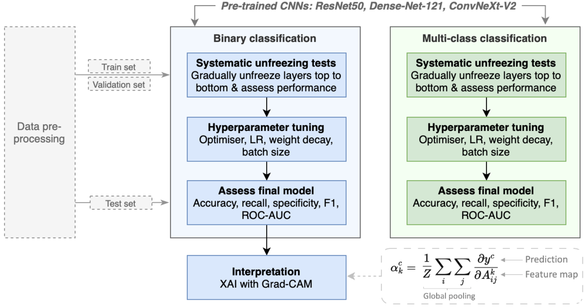
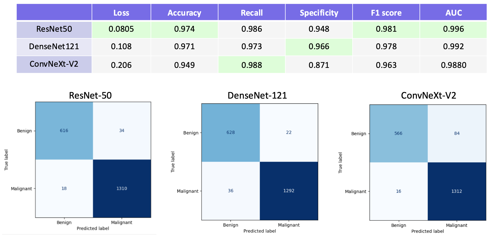
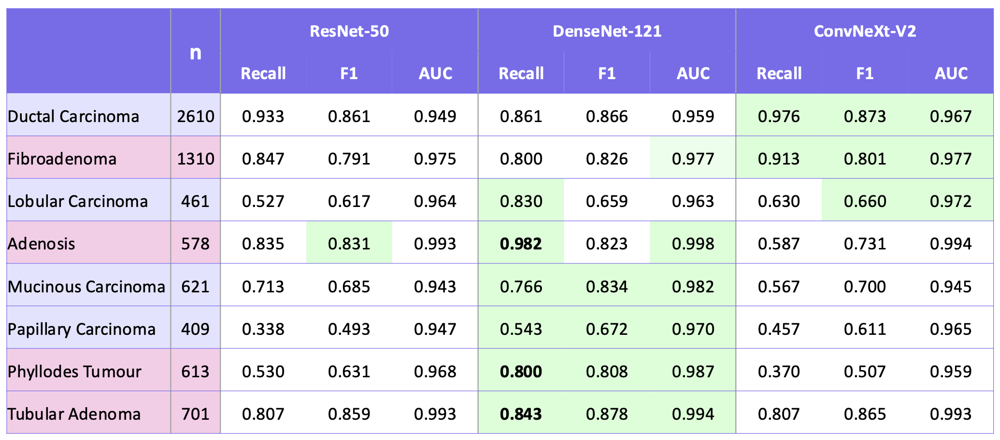
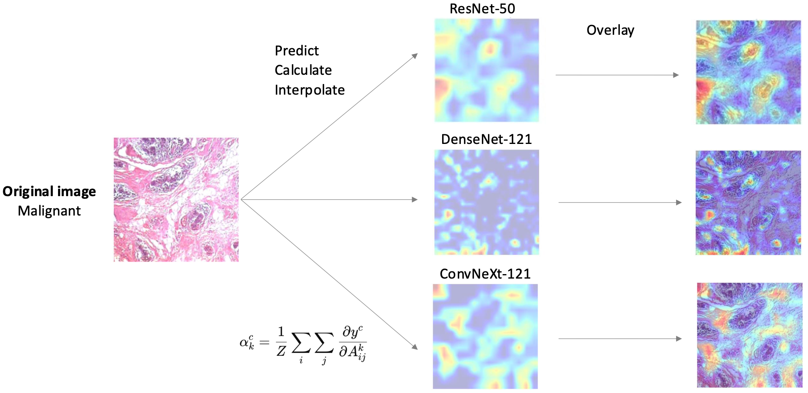

# Interpretable Transfer Learning for Breast Cancer Diagnosis

This project explores the application of transfer learning and explainable AI for histopathology-based breast cancer diagnosis using the [BreakHis dataset](https://www.kaggle.com/datasets/ambarish/breakhis). We benchmark several convolutional neural networks on both binary (benign vs malignant) and multi-class (8 tumour subtypes) classification tasks and integrate Grad-CAM for interpretability. The main aim of this project is to identify robust, interpretable solutions suitable for potential clinical deployment.

# Models
- [ResNet-50](https://docs.pytorch.org/vision/main/models/generated/torchvision.models.resnet50.html): Residual learning with skip connections. Strong performance baseline.
- [DenseNet-121](https://arxiv.org/abs/1608.06993): Dense connectivity for efficient feature reuse. Strong on multi-class tasks.
- [ConvNeXt-V2](https://arxiv.org/abs/2301.00808): SOTA convolutional architecture inspired by vision transformers.

# Analytical pipeline

# Results summary
- ResNet-50 overall best on binary classification task (malignanacy diagnosis).
- DenseNet-121 had the most balanced performance on multi-class classification (tumour subtype diagnosis).
- Grad-CAM heatmaps were generated to visualize the image regions influencing predictions. This enhances model transparency — crucial for clinical decision-making.

## Binary Classification (Benign vs Malignant)


## Multi-Class Classification (Tumour Subtypes)



## Interpretability with Grad-CAM


# Repository structure

```
ML_BreakHis-main/
├── README.md                         # Project overview and instructions
│
├── final_results/                    # Model-specific performance metrics and evaluation outputs
│
├── scr/                              # Scripts & job submission files for pre-processing and models
│   ├── 01-Data_Extract.py/.sh        # Extract data from source
│   ├── 02-Data_Split.py/.sh          # Split dataset into train/val/test
│   ├── 03-Data_Augmentation.py/.sh   # Augment training data
│   ├── 04-ResNet50/                  # All ResNet50 training and testing scripts
│   ├── 05-DenseNet/                  # All DenseNet121 scripts and experiments
│   ├── 06-ConvNeXt-V2/               # All ConvNeXT-V2 model scripts
│   ├── 07a-GradCAM_PyTorch.ipynb     # Grad-CAM interpretation (PyTorch)
│   ├── 07b-GradCAM_Keras.ipynb       # Grad-CAM interpretation (Keras)
│   ├── combined_holdout_metrics.csv  # Summary metrics from all models
│   ├── func.py                       # Shared utility functions
│   ├── Other_Scripts/               # Miscellaneous experimental notebooks
│
├── data/                             # CSV data used for training and evaluation
```

## Example structure of model-specific folder

```
│   ├── 06-ConvNeXt-V2/

│   │   ├── 04-ConvNeXT-V2-architec.py/.sh    # Layer unfreezing tests for binary
│   │   ├── 04b-ConvNeXT-V2-multiclass.py/.sh # Layer unfreezing tests for multiclass
│   │   ├── 04c-ConvNeXT-V2_HPO.py/.sh        # Hyper-parameter optimisation
│   │   ├── 04e/04f CV scripts                # Cross-validation for binary and multiclass
│   │   ├── 04g/04h final training            # Final training scripts
│   │   ├── ConvnextV2_results_explore.ipynb # Visual analysis of results
│   │   └── ConvnextV2_Toydata_code_tests.ipynb # Early testing notebook

```

# Future work

- Improve performance on rare tumour subtypes (e.g., class rebalancing)
- Explore ensemble methods and non-CNN classifier heads (e.g., XGBoost)
- Integrate more advanced XAI tools (e.g., SHAP, integrated gradients)

# Contributors 
Maria Serova, Jingai Si, Fion Tan